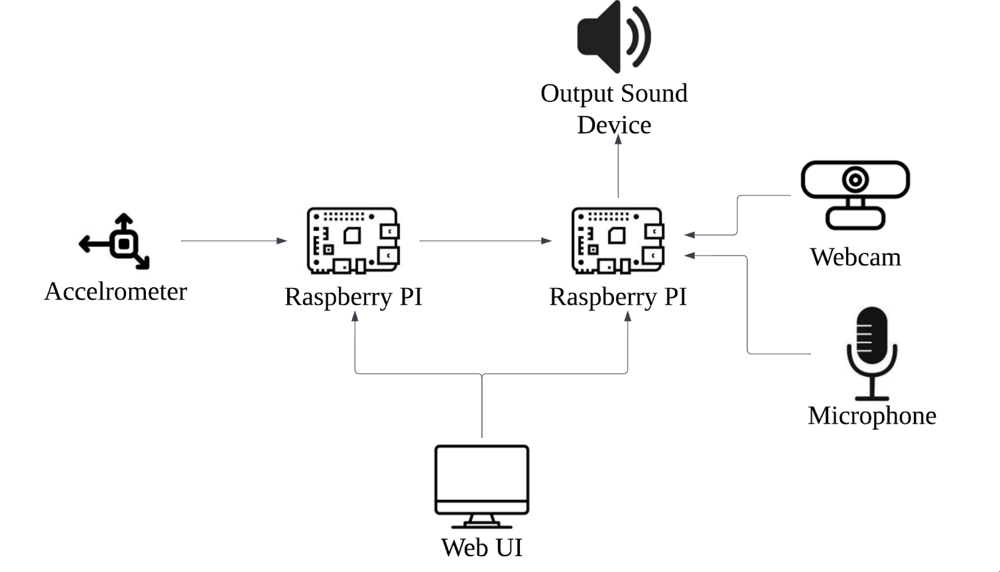

# INF 2009 Group 34

## Project Description
Talk about the project

## Block Diagram

## Setup
If needed..

- How to setup the hardware and front end, prerequisites 

## Accelerometer
What its used for, how its done, results etc etc

## Eye tracking using webcam

This feature is inspired by [Akshay Bahadur](https://github.com/akshaybahadur21/Drowsiness_Detection.git). Credits goes to repo owner.

### Description

The algorithm and [model](models/shape_predictor_68_face_landmarks.dat) of the original code was taken to aid in better detection and measurement of Eye Aspect Ratio (EAR). How it is different is [Webcam](webcam.py) applies MQTT format for easier integration with the other parts of the system, added blinking detection for detection of rapid blinking which is one of the sign of fatigue, as well as customisable thresholds in [Conguration File](config.json) where system user change the values base on different eye behaviours and features.

### Libraries

1) cv2 : A open-source real-time computer vision used for capturing video, process frames and drawing contours around the eyes
2) imutils : convert facial landmarks into a NumPy array format for easier manipualtion
3) dlib : an ML and CV toolkit used for specific facial landmarks, such as the eyes.
4) scipy : to calculate the Euclidean distance between points for Eye Aspect Ratio (EAR)

### How its done 

Each eye is represented by 6 (x, y)-coordinates, starting at the left-corner of the eye (as if you were looking at the person), and then working clockwise around the eye.

It checks value of `threshold` consecutive frames and if the Eye Aspect ratio is less than value of `frame_check`, necessary executions to the system is triggered for long eye closure. Whereas for blinking, it checks `blink_threshold` for EAR specifically for this feature. If it exceeded `blink_count_threshold` within time period of `blink_time_window`, it will trigger rapid blinking. `reset_delay` before it resets and counts again.

#### Base formuale used:

#### Summing up:

#### Results:

Will send alerts through the system by MQTT

For more information, [see](https://www.pyimagesearch.com/2017/05/08/drowsiness-detection-opencv/)

## Fatigue Decision system
What its used for, how its done, results etc
