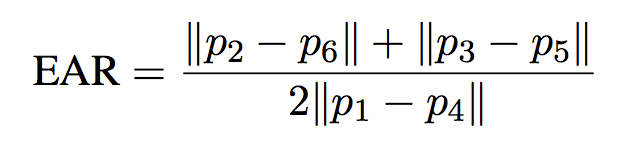

# INF 2009 Group 34

## Project Description
Our project aims to develop a driver fatigue and behavior detection system using a camera, motion sensors, and an accelerometer to monitor driver alertness in real-time. The system and camera tracks eye movement, blinking frequency, and steering patterns to detect signs of fatigue or reckless driving. The raspberry Pi then processes the data locally, ensuring low-latency edge computing without internet or cloud dependency. If unsafe behavior is detected, a speaker triggers an audio alert, prompting the driver to take corrective action. This system enhances road safety by providing real-time monitoring and immediate intervention to prevent accidents.

## Block Diagram


## Setup

For our project, we made use of 2 Raspberry Pi. One primarily for the accelerometer and act as the MQTT broker, and the other for eye tracking algorithm and voice detection. 

### Raspberry Pi 1 (Accelerometer)

Place the following files in the Raspberry Pi

1. [accel.py](accel.py)
2. [config.json](config.json)

Install the required Python Libraries
```
pip install matplotlib
pip install adafruit-circuitpython-lis3dh
pip install paho-mqtt
```

Run the following command to get the IP address of the MQTT broker. Replace the hostname in [accel.py](accel.py) (line 66) with the obtained IP address

`hostname -I` 

Run the file [accel.py](accel.py). Do not move the Raspberry Pi while it is being initializing as it affects the accelerometer reading.

### Raspberry Pi 2 (Eye tracking and voice detection)

Place the following files in the Raspberry Pi

1. [webcam.py](webcam.py)
2. [decision.py](decision.py)
3. [model](models)
4. [models](models/)
5. [config.json](config.json)
6. [test.wav](test.wav). Alternatively, a sound track of your choice

Install the following
```
pip install cmake
sudo apt-get install libatlas-base-dev  
pip install dlib
pip install pyttsx3 pygame vosk pyaudio paho-mqtt
```

Modify the host IP address in [webcam.py](webcam.py) (line 45) and [decision.py](decision.py) (line 97) to the IP address of the MQTT broker

Run both [decision.py](decision.py) and [webcam.py](decision.py)

## Accelerometer

### Description

The accelerometer used is a LIS3DH which is mounted to the Raspberry Pi which is mounted to the vehicles steering wheel. Its goal is to detect the steering wheel movements as well as the acceleration of the car. These measurements will be used to detect potential fatigue in the driver or signs of dangerous driving.

### Libraries
1. busio: Used for I2C protocol to communicate with the accelerometer
2. adafruit_lis3dh: Used to make interfacing with the accelerometer easier
3. matplotlib: used for visualizing the changes in car movement and steering movement

### How its done

The Raspberry Pi communicates with the Accelerometer using I2C protocol and we made use of the Adafruit CircuitPython library in Python to record accelerometer data. The readings from the accelerometer are then put into a FIFO queue for the purposes for decision making and visualisation.

The accelerometer decision system keep tracks of sudden changes of steering movements 'steering_threshold' or sudden acceleration or deceleration (example jam braking) 'accel_threshold' and keep a tally.  These values are reset by a percentage 'percentage_reduce' every time period 'timer_value'

If the number of occurrences exceed a specified threshold 'steering_movement_threshold' and 'sudden_brake_threshold' it will deem that the driver is fatigued/driving dangerously and send a message through MQTT to the central decision system. After a set time 'steering_cooldown' the driver state in the system will reset. 


The visualisation are created using Matplotlib primarily used for testing and configuration of thresholds. It can be omitted during runtime to free up computing resources.

### Results

Detecting driver fatigue


## Eye tracking using webcam

This feature is inspired by [Akshay Bahadur](https://github.com/akshaybahadur21/Drowsiness_Detection.git). Credits goes to repo owner.

### Description

The algorithm and [model](models/shape_predictor_68_face_landmarks.dat) of the original code was taken to aid in better detection and measurement of Eye Aspect Ratio (EAR). How it is different is [Webcam](webcam.py) applies MQTT format for easier integration with the other parts of the system, added blinking detection for detection of rapid blinking which is one of the sign of fatigue, as well as customisable thresholds in [Conguration File](config.json) where system user change the values base on different eye behaviours and features.

### Libraries

1) cv2 : A open-source real-time computer vision used for capturing video, process frames and drawing contours around the eyes
2) imutils : convert facial landmarks into a NumPy array format for easier manipualtion
3) dlib : an ML and CV toolkit used for specific facial landmarks, such as the eyes.
4) scipy : to calculate the Euclidean distance between points for Eye Aspect Ratio (EAR)

### How its done 

Each eye is represented by 6 (x, y)-coordinates, starting at the left-corner of the eye (as if you were looking at the person), and then working clockwise around the eye.

It checks value of `threshold` consecutive frames and if the Eye Aspect ratio is less than value of `frame_check`, necessary executions to the system is triggered for long eye closure. Whereas for blinking, it checks `blink_threshold` for EAR specifically for this feature. If it exceeded `blink_count_threshold` within time period of `blink_time_window`, it will trigger rapid blinking. `reset_delay` before it resets and counts again.


#### Base formuale used:



#### Summing up:


#### Results:

Will send alerts through the system by MQTT


For more information, [see](https://www.pyimagesearch.com/2017/05/08/drowsiness-detection-opencv/)

### Honourable Mentions

During our research, we explored an approach that utilizes a combination of Deep Learning (TensorFlow), Multimodal Applied Machine Learning (MediaPipe), and data preprocessing and model evaluation (Scikit-Learn). This method supports multiple input types, including images, videos, and live webcam feeds. It employs MobileNet and YOLOv5 to detect phones, enhancing performance, and can track facial features such as the mouth and lips. Additionally, the system continuously trains and updates the MobileNet model for improved accuracy over time. More details can be found in this [repo](https://github.com/jhan15/driver_monitoring.git)

While this approach offers a more comprehensive assessment of drowsiness by incorporating multiple criteria, we ultimately did not adopt it for our use case due to several challenges. First, as a fully deployed application, its tightly integrated components made it difficult to modularize for our specific needs without replicating significant portions of the original work. Additionally, running it on a Raspberry Pi resulted in performance issues, likely due to the heavy computational load and bloated dependencies, which exceeded the Pi’s hardware limitations.

Another key reason is that training deep learning models on edge devices, like a Raspberry Pi, is generally inefficient compared to training on the cloud. Training requires high computational power, which edge devices lack, leading to significantly longer training times, thermal throttling, and storage limitations. Cloud environments provide high-performance GPUs/TPUs, scalable resources, and faster iteration cycles, making them the preferred choice for model training. Edge devices are better suited for running optimized inference models (e.g., TensorFlow Lite, YOLOv5n) rather than full-scale model training.

Given these constraints, we opted for the current approach. This will definitely one of the future improvements that we will venture out.


## Fatigue Decision system
What its used for, how its done, results etc

### Description

The Fatigue Decision System is used to check if the driver is fatigued based on the results of the various hardware components like Accelerometer, Microphone and Camera. If the Accelerometer or Camera detects signs of fatigue through the acceleration speed, steering wheel movements or eye movements, a message stating that the driver is fatigued will be sent by MQTT to the main system. Once the system recieves the message stating the driver's fatigue, the microphone will then prompt and listen for the driver to say he is not fatigued. If he does not confirm that he is not fatigued, then an alarm will sound through the chosen audio output device of the system.

### Libraries
1. pyttsx3 - Used for text-to-speech, to communicate with the driver
2. pygame - Used for loading the Alarm audio file
3. vosk - Used for listening to the driver and converting audio input into text
4. pyaudio = Used for listening to the driver
5. paho.mqtt.client = Used for recieving and sending messages between components

### How its done 
The second Raspberry Pi for the main system is connected to a Microphone and an Output Audio Device, which for this project is an Earpiece. It checks for the payload of the  MQTT messages from the first Raspberry Pi connected to the Webcam and Accelerometer through "message.payload.decode()' and if the message is 'Fatigue', then it triggers the main Fatigue Detection function. 

The main Fatigue Detection function uses Pyttsx3 to prompt the user for confirmation that he is not fatigued through the Text-to-Speech feature. Pyaudio is then used to capture the audio input before Vosk is used to process and analyse the audio input. If the audio input is analysed to have contained the phrase "I am awake now", then the system can confirm that the driver has responded correctly and therefore awake. However, if the audio input did not seem to have the phrase, then Pyaudio and Pygame is used to load and play an alarm sound which will be sounded until the driver confirms he is awake.

### Results
If fatigue is detected, alarm sounds until driver is awake.
If fatigue is not detected, no alarm is sounded.
